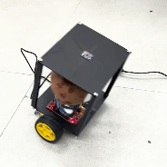

# 이루매 밸런싱 인형 로봇

ATmega128을 이용한 이루매 ~~밸런싱~~ **인사하는** 인형 로봇


- 사용한 부품 목록
  - [ATmega128 AVR 개발/실습키트 JKIT-128-1](https://www.devicemart.co.kr/goods/view?no=1059759)
  - [MPU6050 6축 자이로 가속도 센서 모듈 GY-521](https://www.devicemart.co.kr/goods/view?no=1247052)
  - [L298N 모터드라이버 모듈](https://www.devicemart.co.kr/goods/view?no=1278835)
    - 주 전원(12V)를 여기에 인가하면 5V 전압도 함께 레귤레이팅돼서 나오기 때문에 ATmega128에도 전원을 인가할 수 있는 장점이 있다.
  - 노란색 기어드 DC 모터 및 바퀴 한 쌍
  - 점퍼선 및 브레드보드
  - [플라스틱 타공 로봇프레임 150mm](https://www.devicemart.co.kr/goods/view?no=1342467)
  - 3T 포맥스

## Develop Log

- 2023.11.16. JKIT-128-1 개발 보드에 대한 개발 환경을 구축했다.
  - [Makefile](./build/Makefile)
- 2023.11.17. 디버깅 및 로깅을 위한 컴퓨터와의 UART 통신에 성공했다. 서식 문자도 지정할 수 있도록 코드 작성함.
  - [serial.c](./src/serial.c), [serial.h](./src/serial.h)
- 2023.11.18. MPU6050와 I2C 인터페이스로 통신하여 3차원 상의 가속도, 각속도 값을 가져오는데 성공했다.
  - [i2c.h](./src/i2c.h), [mpu6050.c](./src/mpu6050.c), [mpu6050.h](./src/mpu6050.h)
- 2023.11.19. MPU6050으로 얻은 가속도와 각속도 RAW 값을 실제 물리량으로 변환하는데 성공했다.
- 2023.12.06. L298N 모터 드라이버를 이용하여 DC 모터의 전류를 PWM으로 제어하는데 성공했다. Timer 1의 8bit Fast PWM 모드 사용.
  - [motor.c](./src/motor.c), [motor.h](./src/motor.h)
- 2023.12.07. PID 제어를 위한 코드를 작성했다. Timer 0의 8bit CTC 모드를 사용하여 매 주기마다 제어를 수행할 수 있도록 했다. 우선 P제어만 시도하였고, I 및 D 제어도 해당 인터럽트를 이용하여 구현해야 한다.
- 2023.12.13. Kalman Filter를 이용하여 각속도 센서의 노이즈를 제거하고, 각도를 추정하는데 성공했다.
  - [angle.c](./src/angle.c), [angle.h](./src/angle.h)

## Main Routine

각기 다른 루틴들이 독립적으로 수행되면서 로봇이 밸런싱을 하게 된다.

- MPU6050 TWI(I2C) Polling
  - [main.c](./src/main.c)에서 무한 루프를 돌면서 MPU6050으로부터 가속도, 각속도 값을 읽어온다. 이때 MPU6050로부터 I2C 통신을 통해 내부 레지스터의 값을 읽어오며, 이를 모듈화한 [mpu6050.h](./src/mpu6050.h)의 `mpu6050_get_accel` 및 `mpu6050_get_gyro` 계열 함수를 이용한다.
  - TWI(I2C) 통신은 [i2c.h](./src/i2c.h)로 모듈화 하였으며, 상태 레지스터를 검사하는데 polling 방식을 이용한다.
- PID Control Timer 0 Interrupt
  - [motor.c](./src/motor.c)에서 DC 모터 제어를 위해 Timer 0을 8bit CTC(Clear Timer on Compare match) 모드로 초기화한다.
  - 매 주기마다 인터럽트가 발생하며, 이때 PID 제어를 수행해야 한다. PID 제어 인터럽트 핸들러는 [main.c](./src/main.c)에 정의되어 있다(`SIGNAL(MOTOR_CONTROL_IRQ)`).
- PWM Control using Timer 1
  - PID 제어를 통해 얻은 좌우 DC 모터의 PWM duty ratio를 Timer 1의 8bit Fast PWM 모드를 이용하여 제어한다([motor.c](./src/motor.c)의 `motor_set_duty_ratio` 함수).
  - GPIO output 모드를 이용하여 PWM duty ratio의 부호에 따라 모터의 회전 방향 또한 결정한다([motor.c](./src/motor.c)의 `motor_set_direction` 함수).
- Kalman Filter Timer 2 Interrupt
  - [angle.c](./src/angle.c)에서 외부(여기서는 [main.c](./src/main.c)의 `angle_get_data` 콜백 함수)로부터 전달 받은 가속도, 각속도 값을 이용하여 Kalman Filter 계산을 수행한다.
  - 외부로부터 전달 받을 가속도, 각속도 값은 콜백 함수 형태로 `angle_init` 함수의 인자로 전달받는다.
  - Timer 2의 8bit CTC 모드로 매 주기마다 Kalman Filter를 수행하여 pitch 각도를 추정한다.

## Trial and Error

- ATmega128에서 `vsprintf` 함수의 `%f` 출력 안되는 문제 발생 및 해결.
  - 상황 및 문제
    - `serial_printf` 함수에서 `%f` 서식문자를 지정하여 부동소수점을 출력하는데 `?` 문자로 제대로 표시되지 않는 문제가 발생함.
  - 디버깅
    - ATmega128은 FPU가 존재하지 않기에, 이에 대한 지원이 미흡하다고 판단함.
    - 구글 검색을 통해 printf 서식 문자 `%f` 지원에 대해 알아봄.
  - 해결
    - 컴파일러와 링커에 서식 문자 지정 출력 함수에 대한 지원 flag를 추가하여 해결.
    - `CFLAGS += -Wl,-u,vfprintf -lprintf_flt -lm`
    - `LDFLAGS += -lm -lprintf_flt -Wl,-u,vfprintf`
    - [Makefile](./build/Makefile) 참조.

- MPU6050 레지스터를 읽고 나면 Start I2C Condition에서 블락되는 문제 발생 및 해결.
  - 상황 및 문제
    - `0x3B(ACCEL_XOUT_H)` 레지스터를 지정하고 이후 6바이트를 연속적으로 읽는 코드를 작성함.
    - 이를 통해 X축, Y축, Z축에 대한 가속도를 연속적으로 읽으려 했었음.
    - 이렇게 한번 읽고 나서, 다음에 또 읽을 때 Start I2C Condition에서 블락이 되는 문제 발생.
  - 디버깅
    - I2C 통신하는 각 시퀀스 곳곳에 디버깅 코드(uart 출력 코드)를 넣어 어디서 블락이 되는지 확인.
    - MPU6050 데이터 시트 및 레지스터 맵 확인
    - 예제 코드를 살펴보며 나의 코드와 무엇이 다른지 확인 → 다른 코드들은 X, Y, Z축 하나씩 읽는데 나만 한번에 읽음.
  - 해결
    - MPU6050 Datasheet 9.3 I2C Communications Protocol 참조.
    - Single-Byte Read Sequence와 Burst Read Sequence 경우가 존재하는데, 전자는 1바이트 하나만 읽을 때이고, 후자는 2바이트를 연속으로 읽을 때의 시퀀스를 설명하고 있음.
      ```
      MASTER <S> <AD+W>       <RA>       <S> <AD+R>              <ACK>        <NACK> <P>
      SLAVE             <ACK>      <ACK>            <ACK> <DATA>       <DATA>
      ```
    - **애초에 1바이트 또는 2바이트만 한 시퀀스에 읽을 수 있는 것임.**
    - 2바이트로 구성된 레지스터는 위의 시퀀스대로만 읽기 작업을 수행하니 원할히 값을 가져올 수 있었음.

- 스스로 밸런싱을 하지 못하고 앞뒤로 흔들리기만 하는 문제 발생.
  - 상황 및 문제
    - MPU6050으로부터 얻은 로봇의 기울어진 정도를 이용하여 밸런싱을 하려고 했으나 마음대로 되지 않았음.
    - 
  - 디버깅
    - 처음에는 y-axis에 대한 가속도 정보로만 PID 제어를 수행했었으나, y-axis에 대한 가속도 정보는 선형성을 보장하지 않기에 이것이 원인이라고 판단함.
    - x, y, z축에 대한 가속도 정보를 모두 이용하여 로봇이 현재 기울어진 각도를 어느 정도 정확하게 구해볼 수 있었음.
    - 그러나, 외란이 심해지면 가속도계에 노이즈가 심하게 끼어 밸런싱하는 데에 사용을 할 수가 없었음.
    - 그러던 와중, 각속도와 가속도를 동시에 이용하여 각도를 추정하는 Kalman Filter를 알게 되었고, 이를 이용하여 로봇의 각도를 추정하는데 성공함. 덕분에 심하게 흔들려도 로봇이 기울어진 각도를 가속도계와 각속도계가 서로 보완하여 정확한 각도를 알 수 있었음.
    - 그러나, 이렇게 추정한 각도를 이용하여 PID 제어를 수행하였음에도 불구하고 로봇이 밸런싱을 하지 못하고 앞뒤로 흔들리기만 하는 문제가 발생함.
    - 다시 원점으로 돌아가 로봇이 밸런싱하는 모습을 관찰함.
    - 노란색 기어드 DC 모터의 Dead-Zone으로 인해 발생하는 문제라고 판단함. 아주 살짝이라도, 어느 정도 기울었을 때 DC 모터가 앞뒤로 움직여야 하는데, 이 Dead-Zone 때문에 움직이지 않고 많이 기울어졌을 때 움직이는 것이 문제라고 판단함. DC 모터가 작동하는 최소 전류부터 작동하게끔 해보았지만, 작동하는 최소 전류가 너무 크기에 급발진하는 모습을 보였음. 이 때문에 로봇이 기울어진 만큼의 반발력을 정확히 주는 것이 너무 어려웠음.
  - 해결
    - 미해결.
    - Dead-Zone 문제를 해결해 보아야 할 것 같음.
    - 제어 주기가 너무 느려서 그런 것일 수도 있음(디버깅을 해보거나, 오실로스코프와 같은 장비로 확인할 필요성이 있음).

## Miscellaneous

- `upload.sh`

  - 프로젝트를 빌드하고 `avrdude` 명령어를 이용하여 업로드까지 하는 자동화 쉘 스크립트이다.

  ```sh
  #!/bin/bash
  set -e
  export PROJECT=balancing-irumae
  export PROGRAMMER=stk500
  export PORT=/dev/tty.SLAB_USBtoUART

  # Build the project
  echo "Building the project..."
  cd build
  make

  # Upload the project
  avrdude -c $PROGRAMMER -P $PORT -p m128 -U flash:w:$PROJECT.hex
  ```

- `.vscode/c_cpp_properties.json`

  - vscode에서 include path를 지정하여 C/C++ IntelliSense 기능을 활용할 수 있다.

  ```json
  {
    "configurations": [
      {
        "name": "Mac",
        "includePath": [
          "${workspaceFolder}/**",
          "/opt/homebrew/Cellar/avr-gcc@9/9.4.0/avr/include"
        ],
        "compilerPath": "/opt/homebrew/bin/avr-gcc",
        "cStandard": "c99",
        "cppStandard": "c++17",
        "intelliSenseMode": "macos-gcc-arm64"
      }
    ],
    "version": 4
  }
  ```
